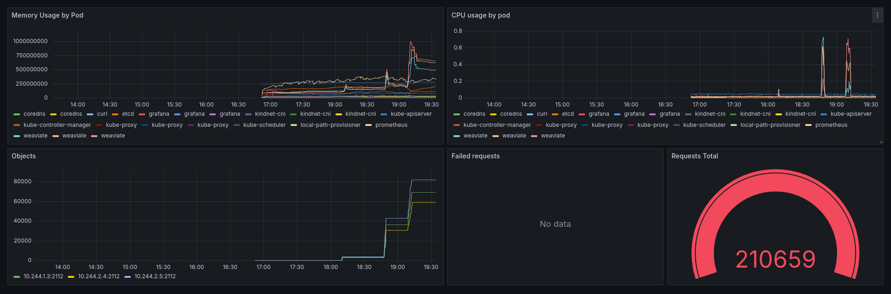

# weaviate-benchmark-tool

This tool aims to retrieve latencies (client-side) when performing operations such as creating classes, objects or tenants.

## Tenant bottleneck

In the event of a client reporting a bottleneck when creating a new tenant. The following steps can be undertaken to 
determine the underlying root cause.

1. Build the tool with Go in the root folder of the project.
```javascript I'm A tab
go build .
```
NOTE: If the cluster has authentication enabled, export the secret as an env variable. e.g

```
export WEAVIATE_API_KEY=<YOUR_API_KEY>
```

2. Try to add a tenant to the required collection

```
./weaviate-benchmark-tool -H <HOSTNAME> -S <SCHEME> add tenant \
-c <CLASS_NAME> \
-n <TENANT_NAME>
```

The output should look similar to 

```
Tenant (tenant-0) has been created in 27.122275ms
```

3. One could also perform a list operation on all the tenants in a collection by running the following command.

```
./weaviate-benchmark-tool -H <HOSTNAME> -S <SCHEME> list tenant \
-c <CLASS_NAME> \
-n <TENANT_NAME>
```

#### Considerations

1. **Distance between services**

If the latency is suspiciously high, there are some things to consider. For instance, if the **Weaviate** cluster is 
deployed as part of a Kubernetes cluster. You could run the tool inside the cluster. You can build the docker
image yourself.

```
docker build . -t weaviate-benchmark-tool
```
You will also need to push the image to a **container registry** that your cluster has access to.

Then one can create a pod that will execute the commands that will retrieve the latency when adding a tenant.
This way the latency should be reduced since it will take less time for the request to reach the server from the same cluster.


2. **Resource allocation**

The cluster might have run out of resources and, therefore it is struggling. One could use the metrics server to check 
upon the resources used by the weaviate cluster and its toll on the nodes. Or could inspect the metrics scraped by prometheus
and then later visualize them in Grafana. Make sure that your **weaviate** instance exports Prometheus metrics before 
proceeding further.

```
PROMETHEUS_MONITORING_ENABLED=true
```

NOTE: the manifests referenced below need altering to match your **weaviate** configuration.

Prometheus example
```
kubectl apply -f monitoring/prometheus/rbac.yaml
kubectl apply -f monitoring/prometheus/config-map.yaml
kubectl apply -f monitoring/prometheus/prometheus.yaml
```

Grafana example
```
kubectl apply -f monitoring/grafana/config-map.yaml
kubectl apply -f monitoring/grafana/grafana.yaml
```

In the example provided above, Prometheus will scrape metrics provided by the **weaviate cluster** and Kubernetes.

One could import the **_monitoring/grafana/dashboard.json_** in the Grafana instance. This one will show you the CPU and memory
used by every pod along with the distribution of objects per weaviate instance and the number of failed requests.



If the CPU and memory used by the **weaviate** is too high, increasing the container requests or scaling the weaviate deployment might
help, but the resources available in the cluster need to be also taken into consideration. Moreover, the deployment might
have some limits set and thus cannot use more resources. 

One thing to consider as well is the distribution of objects per instance, these should be balanced as some tenants might
end up on the overloaded node.

3. **High traffic**

If the dashboard is indicating a high failure rate along with a large number of requests, the network might be the culprit
as the given number of instances cannot process such a high number of requests.

4. **Reproduction**

If none of the implication above have been met. One could try reproducing the state onto another Kubernetes cluster with 
similar configuration.

One could import the dataset available in the other cluster or generate objects with the **_benchmark tool_** as such. E.g

a. Create class from file. The file must contain the class definition in json format.
```
./weaviate-benchmark-tool -H <HOSTNAME> -S <SCHEME> add class -f <path_to_file>
```

b. (Optional) is auto-tenancy is not enabled. You must create the tenants as well.

```
./weaviate-benchmark-tool -H <HOSTNAME> -S <SCHEME> add tenant -c <class_name> -n <tenant_name>
```

You can also generate a number of tenants for your class, if auto-tenancy is not enabled.

```
./weaviate-benchmark-tool -H <HOSTNAME> -S <SCHEME> generate tenant \
 -c <class_name> \
 -n <tenant_name> \
 -p <tenant_prefix_name>
```

c. And finally one can also generate a number of objects.

```
./weaviate-benchmark-tool -H <HOSTNAME> -S <SCHEME> generate object \
 -c <class_name> \
 -o <number_of_objects> \
 -t <numer_of_tenants> \
 -v <vector_length> \
 -p <tenant_prefix_name
```

If the metrics are not similar and the data stored and the specs are the same when comparing the performance, then the underperforming cluster might suffer from misconfiguration of the nodes or Kubernetes itself. You should consider 
node failures or packet loss at the level of the cluster and further investigation must be undertaken at a lower level.
leve.